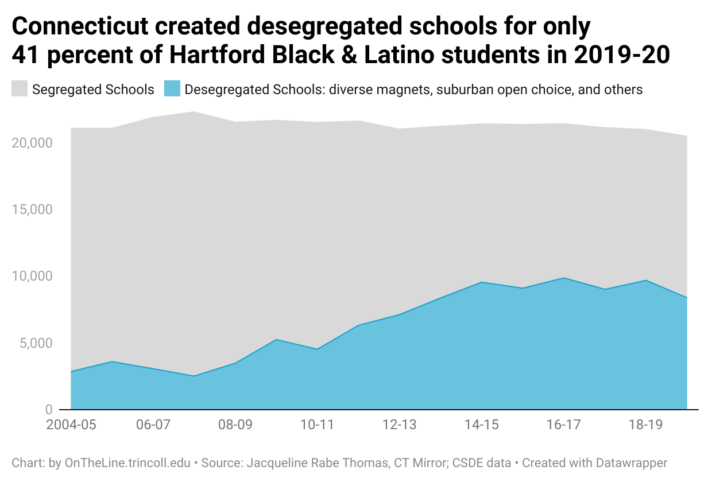
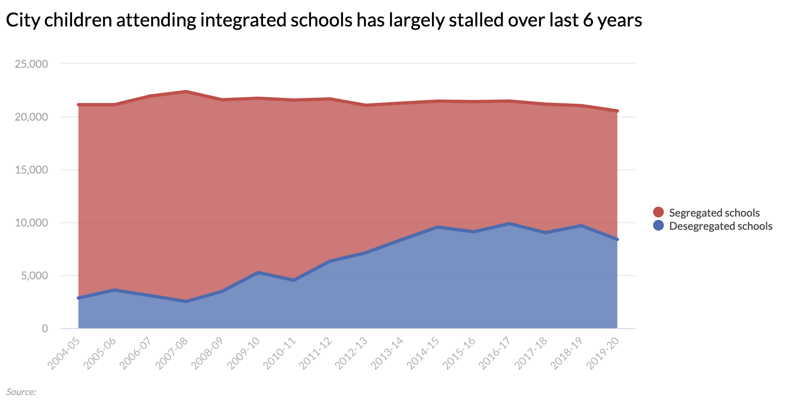
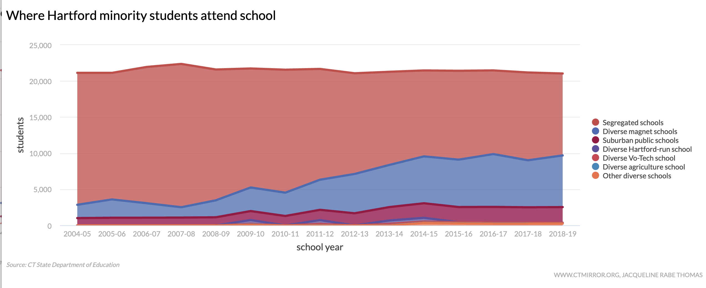
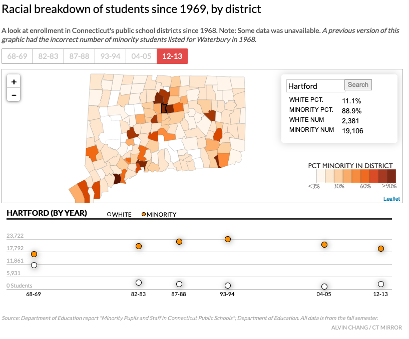
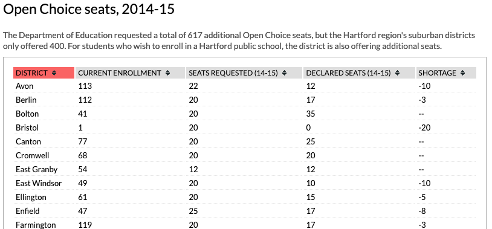
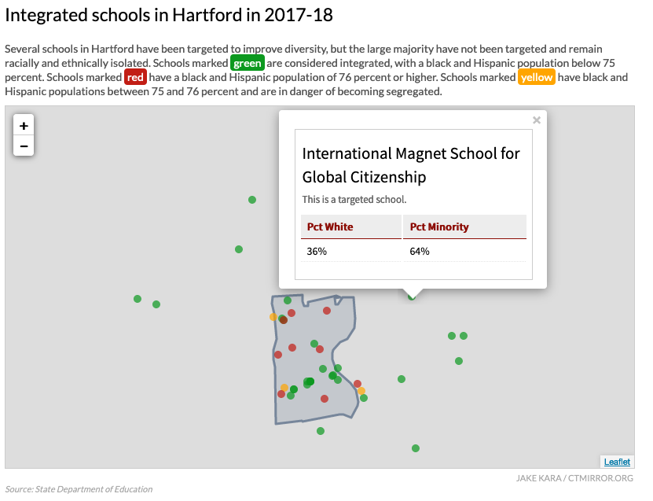
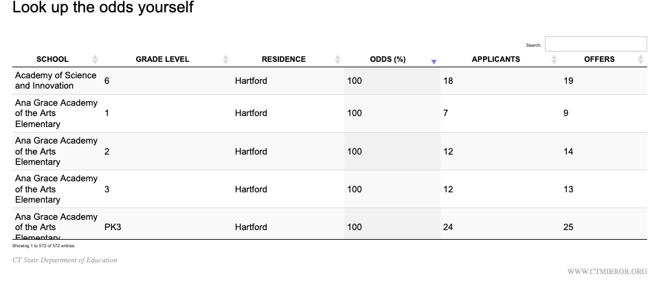
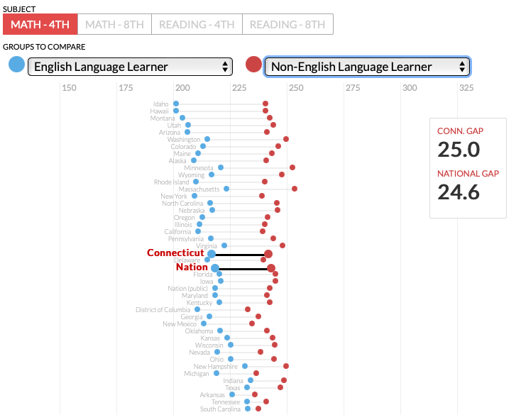
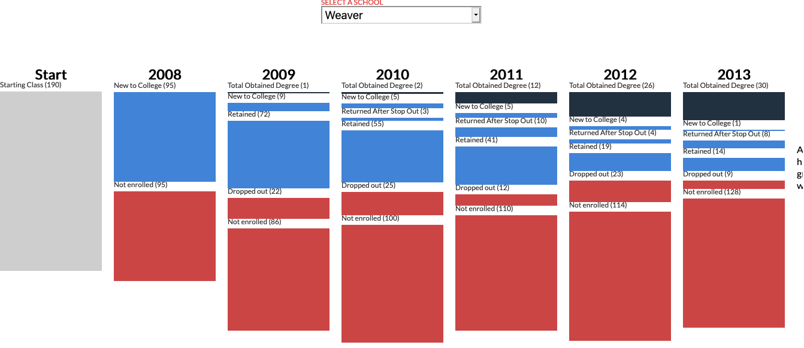

# otl-ctm-projects
CT Mirror race and education data projects by Alvin Chang, Jake Kara, Jacqueline Rabe Thomas

see subfolders with data, code, and screenshots for items listed below

## Hartford minority students in desegregated schools, 2004-05 to 2019-20

[OnTheLine Datawrapper version](https://datawrapper.dwcdn.net/fdcm0/3/) above, based on data.csv extracted from CTM 2019-20 chart below

GitHub Pages link https://ontheline.github.io/otl-ctm-projects/students-desegregated-19-20/

original link https://projects.ctmirror.org/tools/chart/charts/Citychildrenattendingintegratedschoolshaslargelystalledoverlast6years-5-0-2020-28302.html

interactive chart for story Jan 10 2020 https://ctmirror.org/2020/01/10/state-settles-school-desegregation-case/

#### See also disaggregated by school type, and subfolders for earlier years

original link https://projects.ctmirror.org/tools/chart/charts/WhereHartfordminoritystudentsattendschool-4-11-2018-36291.html

interactive chart for story Dec 27 2018 https://ctmirror.org/2018/12/27/segregated-hartford-schools-await-next-governor/

## Racial composition of school districts, 1969-2013

GitHub Pages link https://ontheline.github.io/otl-ctm-projects/race-districts-1969-2013/

original link https://projects.ctmirror.org/content/2014/05/raceSchools/

interactive map for story https://ctmirror.org/2014/06/20/60-years-after-brown-vs-board-of-education-still-separate-in-connecticut/

## Open Choice Seats, 2014-15

GitHub Pages link https://ontheline.github.io/otl-ctm-projects/open-choice-table-2014-15/

original link https://projects.ctmirror.org/content/2014/05/openChoice/

interactive map for story https://ctmirror.org/2014/06/20/60-years-after-brown-vs-board-of-education-still-separate-in-connecticut/

## Integrated Schools in Hartford Region, 2017-18

GitHub Pages link https://ontheline.github.io/otl-ctm-projects/integrated-schools-2017-18/

original link https://projects.ctmirror.org/content/2018/02/integratedSchools/

interactive map for story Feb 27 2018 https://ctmirror.org/category/ct-viewpoints/school-choice-lottery-mystery-parents-desegregation-efforts-wane/

#### See also subfolders for prior years and external links:
- Note that some prior years have GeoJSON errors
- Integrated Schools in Hartford, 2016-17 https://projects.ctmirror.org/content/2016/12/integratedSchools/, interactive map for story https://ctmirror.org/2016/12/01/new-data-majority-of-hartford-schools-still-segregated-some-progress-made/
- Integrated Schools in Hartford, 2014-15 https://projects.ctmirror.org/content/2014/11/integratedSchools/, interactive map for story https://ctmirror.org/2014/12/10/thousands-pass-on-school-choice-lottery-despite-robust-options/

## Magnet school odds of admission lookup, 2018

GitHub Pages link https://ontheline.github.io/otl-ctm-projects/odds-magnet-2018/

original link https://projects.ctmirror.org/tools/fancytable/table.html?d=TheOdds-2018-12345

interactive table for story Feb 27 2018 https://ctmirror.org/category/ct-viewpoints/school-choice-lottery-mystery-parents-desegregation-efforts-wane/

## Achievement gap 2015

GitHub Pages link https://ontheline.github.io/otl-ctm-projects/achievement-gap-2015/

original link https://projects.ctmirror.org/content/trend/2015/10/gradgap/index.html

interactive chart for story Oct 28, 2015 https://ctmirror.org/2015/10/28/cts-report-card-achievement-gap-shrinks-but-for-wrong-reason/

## College cohort 2015

GitHub Pages link https://ontheline.github.io/otl-ctm-projects/college-cohort-2015/

original link http://projects.ctmirror.org/content/trend/2015/4/college_cohort/

interactive for story (no longer appears online) http://trendct.org/2015/04/29/only-1-in-4-hartford-high-school-grads-got-a-college-degree-within-six-years/
