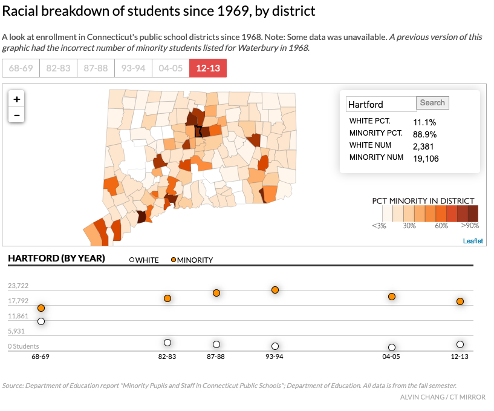
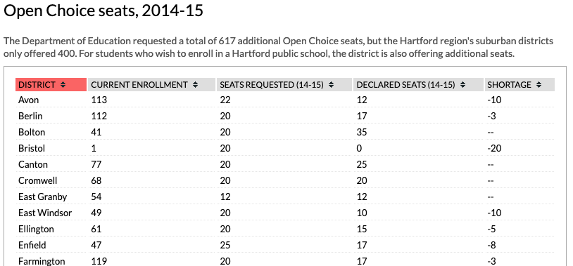
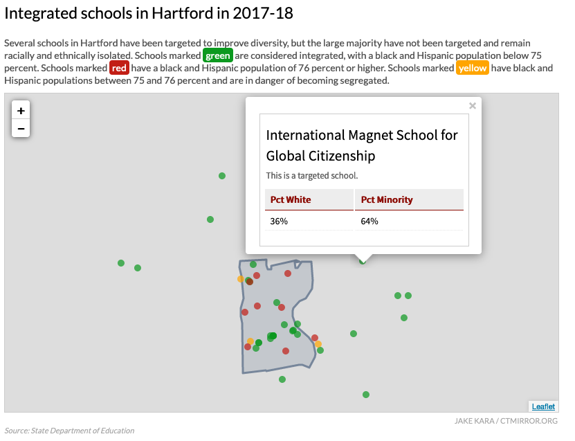
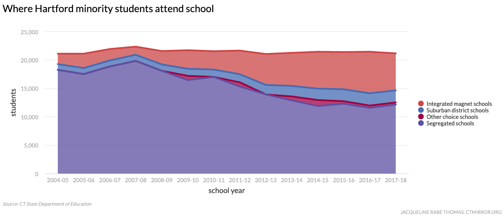
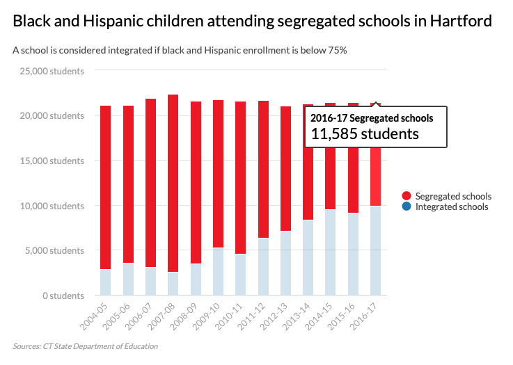
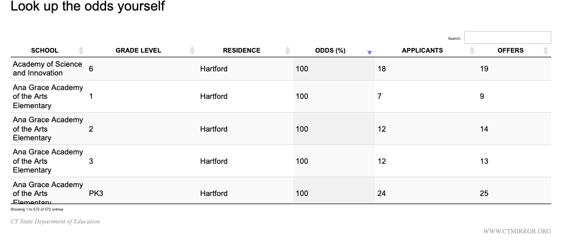
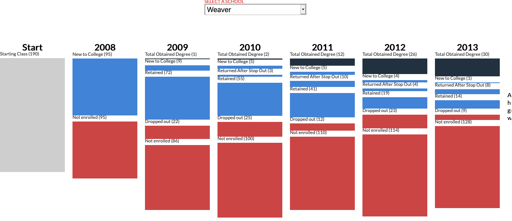

# otl-ctm-projects
CT Mirror race and education data projects by Alvin Chang, Jake Kara, Jacqueline Rabe Thomas

see subfolders with data, code, and screenshots for items listed below

## Racial breakdown of students since 1969, by district
https://projects.ctmirror.org/content/2014/05/raceSchools/

interactive map for story https://ctmirror.org/2014/06/20/60-years-after-brown-vs-board-of-education-still-separate-in-connecticut/

## Open Choice Seats, 2014-15
https://projects.ctmirror.org/content/2014/05/openChoice/

interactive map for story https://ctmirror.org/2014/06/20/60-years-after-brown-vs-board-of-education-still-separate-in-connecticut/

## Integrated Schools in Hartford, 2017-18
https://projects.ctmirror.org/content/2018/02/integratedSchools/

interactive map for story Feb 27 2018 https://ctmirror.org/category/ct-viewpoints/school-choice-lottery-mystery-parents-desegregation-efforts-wane/

- see also prior years:
- Integrated Schools in Hartford, 2016-17 https://projects.ctmirror.org/content/2016/12/integratedSchools/, interactive map for story https://ctmirror.org/2016/12/01/new-data-majority-of-hartford-schools-still-segregated-some-progress-made/
- Integrated Schools in Hartford, 2014-15 https://projects.ctmirror.org/content/2014/11/integratedSchools/, interactive map for story https://ctmirror.org/2014/12/10/thousands-pass-on-school-choice-lottery-despite-robust-options/

## Where Hartford minority students attend school, 2004-05 to 2017-18
https://projects.ctmirror.org/tools/chart/charts/WhereHartfordminoritystudentsattendschool-1-1-2018-38644.html

interactive chart for story Feb 27 2018 https://ctmirror.org/category/ct-viewpoints/school-choice-lottery-mystery-parents-desegregation-efforts-wane/

## Black and Hispanic children attending segregated schools in Hartford, 2004-05 to 2016-17
https://projects.ctmirror.org/tools/chart/charts/BlackandHispanicchildrenattendingsegregatedschoolsinHartford-4-11-2016-61826.html

interactive chart for story https://ctmirror.org/2016/12/01/new-data-majority-of-hartford-schools-still-segregated-some-progress-made/

## Look up the odds yourself (magnet admission, 2018)
https://projects.ctmirror.org/tools/fancytable/table.html?d=TheOdds-2018-12345

interactive table for story Feb 27 2018 https://ctmirror.org/category/ct-viewpoints/school-choice-lottery-mystery-parents-desegregation-efforts-wane/

## College cohort 2015
http://projects.ctmirror.org/content/trend/2015/4/college_cohort/

interactive for story (no longer appears online) http://trendct.org/2015/04/29/only-1-in-4-hartford-high-school-grads-got-a-college-degree-within-six-years/

